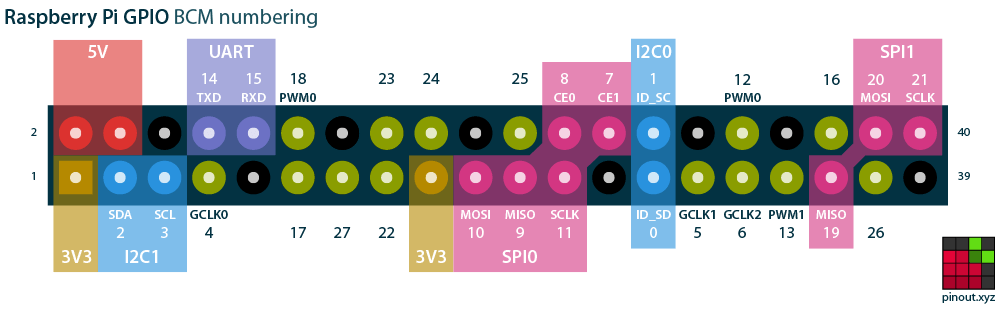
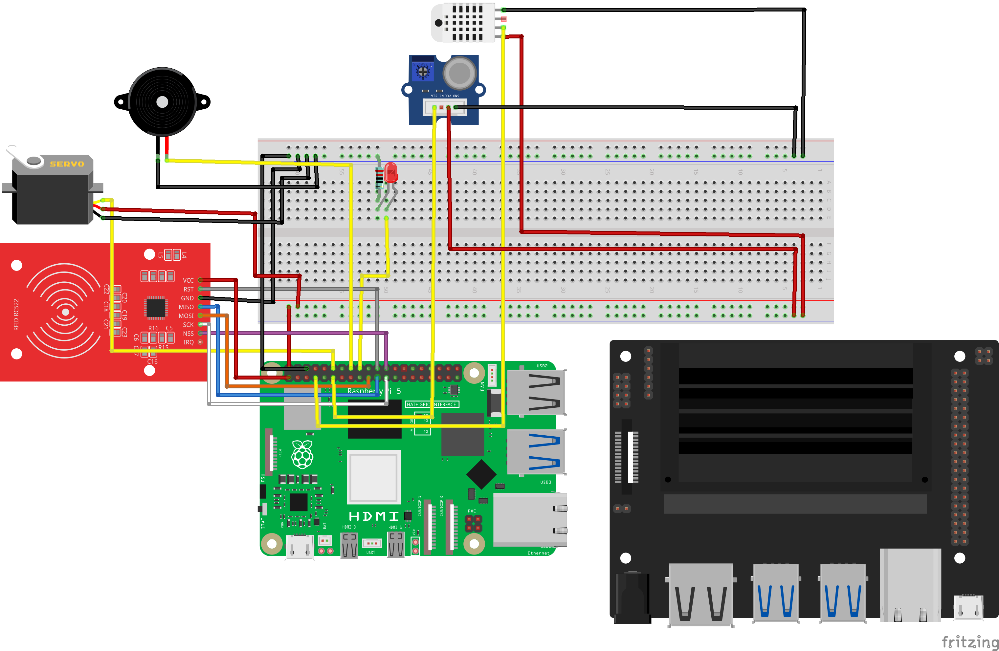
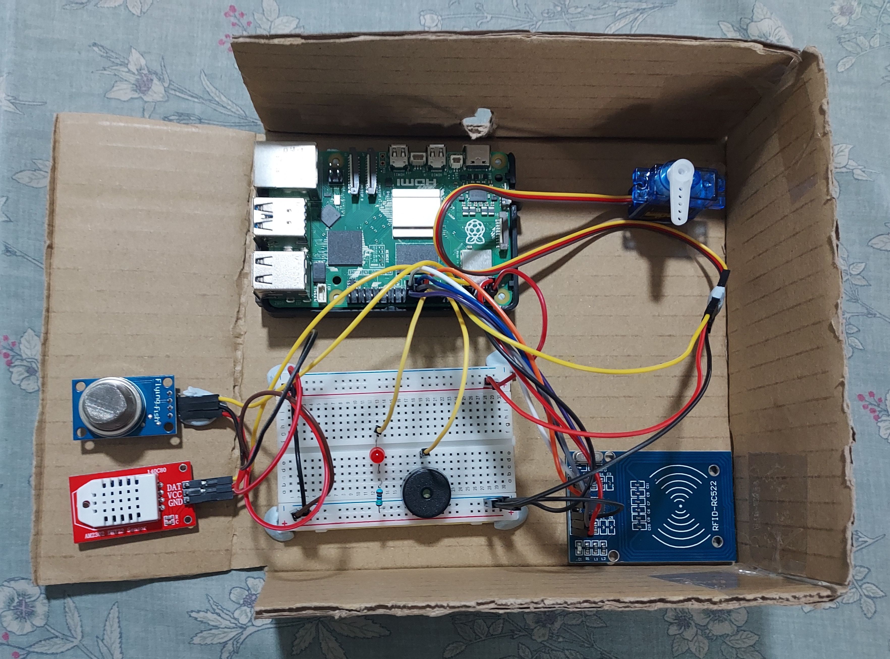

# Fire Detection System - INF2009

## Project Structure

```
INF2009-Edge-Computing-Project/
│
├── ai/                            # Jetson Orin Nano vision node
│   ├── fire_orin_v1/              # Trained YOLOv8 model artefacts
│   │   ├── fire_orin_best.pt      # PyTorch weights
│   │   ├── fire_orin_best.onnx    # ONNX export
│   │   ├── fire_orin_best.engine  # TensorRT engine (Orin-compiled)
│   │   └── fire_orin_best.cache   # TensorRT build cache
│   │
│   └── jetson/
│       ├── jetsonscript.py        # Main inference loop: camera -> YOLO -> MQTT
│       ├── benchmark_latency.py   # 100-run latency benchmark (capture/infer/mqtt)
│       ├── benchmark_results.txt  # Last benchmark output
│       └── camera_test.jpg        # Static frame used during camera verification
│
├── rpi/                           # Raspberry Pi edge node
│   ├── main.py                    # Orchestrator
│   ├── config.py                  # All pins, thresholds, timing
│   ├── .env.example               # Environment variable template
│   │
│   ├── sensors/
│   │   ├── gas_sensor.py          # MQ2 digital read + debounce
│   │   └── temp_sensor.py         # DHT22 background thread + averaging
│   │
│   ├── actuators/
│   │   ├── alarm.py               # LED + buzzer (CLEAR / WARNING / FIRE states)
│   │   └── smart_door.py          # RFID reader + servo (normal / fire modes)
│   │
│   ├── utils/
│   │   ├── fusion.py              # Weighted score engine + sim override injection
│   │   └── latency_logger.py      # Loop-stage timing logger (console + CSV)
│   │
│   ├── comms/
│   │   └── mqtt_client.py         # Dual-broker MQTT (local: Jetson vision, cloud: AWS)
│   │
│   ├── sim/
│   │   ├── sim_flags.py           # Flag file read/write API
│   │   └── sim_gui.py             # Demo GUI - run in separate terminal
│   │
│   ├── tests/
│   │   ├── test_sensors.py
│   │   ├── test_actuators.py
│   │   ├── test_fusion.py
│   │   ├── test_mqtt.py
│   │   └── test_latency.py
│   │
│   └── logs/
│       └── latency_log.csv        # Runtime latency measurements
│
└── cloud/
    └── aws/                       # Dockerized cloud pipeline + dashboard
```

---

## RPI Hardware Pin Reference (BCM / Physical)







| Component     | Signal        | GPIO (BCM) | Physical Pin |
|---------------|---------------|------------|--------------|
| MQ2           | DO            | GPIO 17    | Pin 11       |
| DHT22         | DAT           | GPIO 4     | Pin 7        |
| LED           | Signal        | GPIO 24    | Pin 18       |
| Buzzer        | PWM           | GPIO 23    | Pin 16       |
| Servo         | PWM signal    | GPIO 18    | Pin 12       |
| RFID SDA      | SPI CE0       | GPIO 8     | Pin 24       |
| RFID SCK      | SPI CLK       | GPIO 11    | Pin 23       |
| RFID MOSI     | SPI MOSI      | GPIO 10    | Pin 19       |
| RFID MISO     | SPI MISO      | GPIO 9     | Pin 21       |
| RFID RST      | Reset         | GPIO 25    | Pin 22       |
| RFID VCC      | 3.3V only     | -          | Pin 1        |
| GND           | Ground        | -          | Pin 6        |
| 5V VCC        | 5V            | -          | Pin 4        |

---

## Setup

### 1. Enable SPI (for RFID)
```bash
sudo raspi-config
# Interface Options -> SPI -> Enable -> Reboot
```

### 2. Install dependencies
```bash
sudo apt update
sudo apt install python3-pip mosquitto mosquitto-clients
sudo systemctl enable mosquitto
sudo systemctl start mosquitto

python -m pip install --upgrade pip setuptools wheel
python -m pip install rpi-lgpio gpiozero mfrc522 spidev adafruit-circuitpython-dht paho-mqtt python-dotenv
```

### 3. 
```bash
Transfer code over to RPI:

scp -r "C:\Users\example\INF2009-Edge-Computing-Project" <Raspberry Pi Name>@:<Raspberry Pi IP>/home/<Raspberry Pi Name>/
```

### 4. 
```bash
Create Virtual Environment in RPI:

cd INF2009-Edge-Computing-Project/rpi
python -m venv venv

Activate venv:
source venv/bin/activate
```

### 5. Configure environment
```bash
cp .env.example .env
# Edit .env and set MQTT_CLOUD_BROKER, AUTHORISED_CARDS, etc.
```

---

## Running the System

### Full system
```bash
# From the rpi/ directory:
cd rpi

# Terminal 1 - main system
python main.py

# Terminal 2 - simulation GUI (optional, for demos)
python sim/sim_gui.py

# Terminal 3 - watch MQTT messages (optional)
mosquitto_sub -h localhost -t "fire_detection/#" -v
```

### Individual component tests
```bash
# From the rpi/ directory:
python tests/test_sensors.py      # gas + temp only
python tests/test_actuators.py    # LED, buzzer, servo, RFID only
python tests/test_fusion.py       # scoring logic, no hardware needed
python tests/test_mqtt.py         # MQTT publish/subscribe
python tests/test_latency.py      # latency benchmark
```

### Latency logging
Latency logging is enabled in `main.py` via `LatencyLogger()` and records stage timings every loop tick.

- CSV output: `rpi/logs/latency_log.csv`
- Console summary: printed every ~5 seconds (throttled)
- Loop budget target: 100ms (`budget_ok=True/False` in CSV)

Logged stages:

- `gas_read`
- `temp_read`
- `fusion`
- `vision`
- `actuation`
- `mqtt_publish`
- `mqtt_transit_ms` (async — Jetson->Pi network transit time)
- `total_loop_ms`

---

## Fusion Score Reference

| Sensors triggered         | Score | Decision |
|---------------------------|-------|----------|
| None                      | 0.0   | CLEAR    |
| Temp only                 | 0.2   | WARNING  |
| Gas only                  | 0.4   | WARNING  |
| Vision only               | 0.4   | WARNING  |
| Gas + Temp                | 0.6   | FIRE     |
| Gas + Temp + Vision (1.0) | 1.0   | FIRE     |

Weights: Gas=0.4, Temp=0.2, Vision=0.4
Fire threshold: 0.5 - tune in config.py

---

## Demo Guide (Simulation GUI)

| Button        | What it does                                          |
|---------------|-------------------------------------------------------|
|  Full Fire    | Injects gas+temp+vision - triggers FIRE state         |
|  Gas Only     | Injects gas only - triggers WARNING (LED on, no buzz) |
|  Temp Only    | Injects temp only - triggers WARNING                  |
|  Clear        | Resets all scenarios - system returns to sensor reads |
|  Force Alarm  | Bypasses score - forces buzzer+LED on immediately     |
|  Lock Door    | Forces servo to locked position                       |
|  Unlock Door  | Forces servo to unlocked position                     |

## Jetson Orin Nano (Vision Node)

The Jetson runs a YOLOv8 fire/smoke detector using a TensorRT-optimised engine and publishes confidence scores to the Pi over local MQTT.

### Dependencies

```bash
pip install ultralytics paho-mqtt python-dotenv
# OpenCV is loaded from the system path (GStreamer support required)
# CUDA 12.6 libs must be present at /usr/local/cuda-12.6/lib64
```

### Running

```bash
# From the ai/jetson/ directory:
cd ai/jetson

# Main inference loop (camera -> YOLO -> MQTT)
python jetsonscript.py

# Latency benchmark (100 runs, writes results to benchmark_results.txt)
python benchmark_latency.py
```

The main script:
- Loads `ai/fire_orin_v1/fire_orin_best.engine` (TensorRT, Orin-compiled)
- Opens the CSI camera via a GStreamer pipeline (1280×720 @ 30 fps)
- Runs 10 warm-up frames before entering the inference loop
- Publishes `{"confidence": 1.0, "t_sent": <timestamp>}` to `fire_detection/vision` whenever fire/smoke is confirmed across a 5-frame history window
- Logs first-detection latency to `first_detection_latency.txt`

### Benchmark results (last run: 2026-03-29)

| Stage          | avg     | p95     |
|----------------|---------|---------|
| capture_ms     | 16.4 ms | 20.5 ms |
| inference_ms   | 14.5 ms | 19.6 ms |
| mqtt_publish_ms| 0.34 ms | 0.42 ms |
| total_ms       | 31.2 ms | 38.2 ms |

---

## Cloud Dashboard Deployment (AWS)

Cloud logging + visualisation stack is available in:

- `cloud/aws`

It deploys:

- Mosquitto (cloud MQTT ingestion)
- Telegraf (MQTT -> time-series pipeline)
- InfluxDB (logging storage)
- Grafana (dashboard)
- Telegram Bridge (FIRE alert notifications)

See setup guide:

- `cloud/aws/README.md`